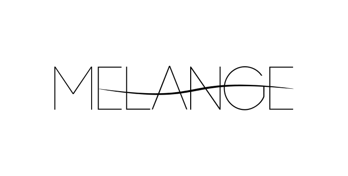

import Carousel from "../../../../components/Carousel"
import { graphql } from "gatsby"
import ArticleCarouselItem from "../../../../components/Article/articleCarouselItem"

## Melange is a fashion brand that was inspired by the need to balance trends with culture and aesthetics. The word “Melange” captures this, it has a French root and it means a mixture or combination of different trends as related to fashion.

## This brand is designed to cater for the chic and fashion conscious woman. She wants her style to be in tune with the current trends, yet timeless.

The objective was to design a logo that is classy and beautiful. The logo should be representative of the chic yet timeless style of Melange’s target audience.

#### 

The minimalistic style was selected to keep the design timeless. The combination of the simple wordmark and swirl captures the feel of “Melange” being high class yet relaxed and fun.

<Carousel marginBottom={50}>
  {
    props.data.carousel.nodes.map(image => (
      <ArticleCarouselItem
        fluid={image.childImageSharp.fluid}
    />
    ))
  }
</Carousel>

export const pageQuery = graphql`
 {
  carousel: allFile(filter: {relativeDirectory: {eq:"digital/melange/carousel"}}, sort: {fields: name, order: ASC}){
      nodes{
        name
        childImageSharp{
          fluid(quality: 100){
              ...GatsbyImageSharpFluid_withWebp
          }
        }
      }
    }
 }
`
