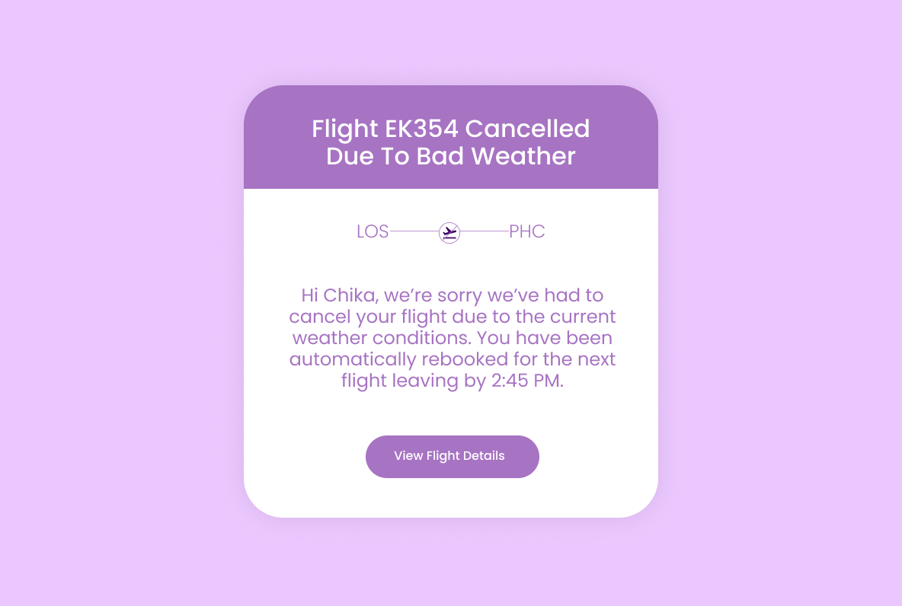
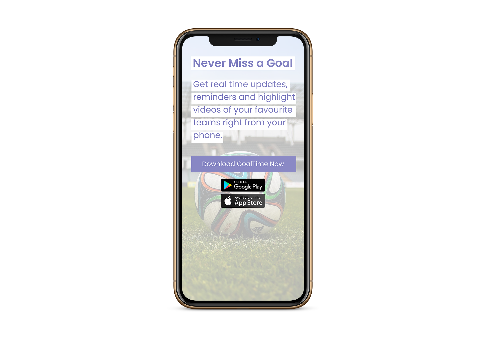
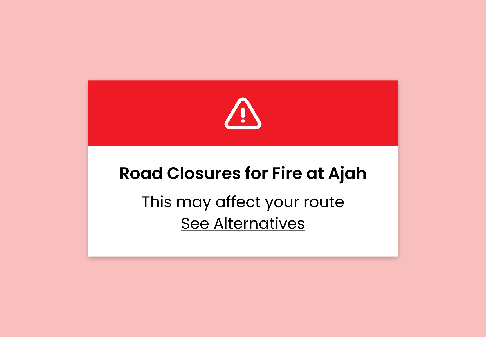
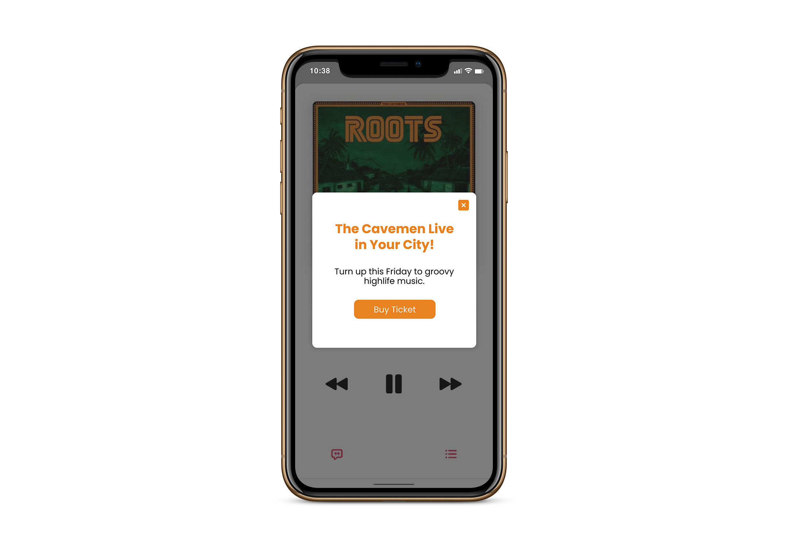
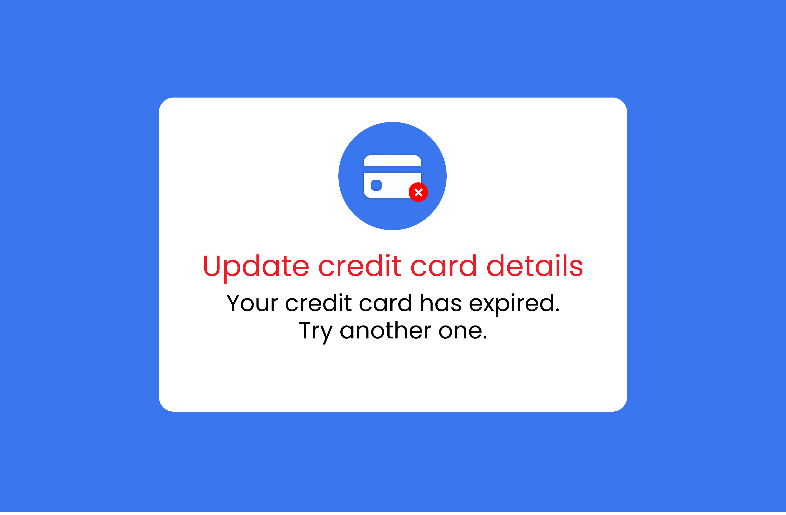
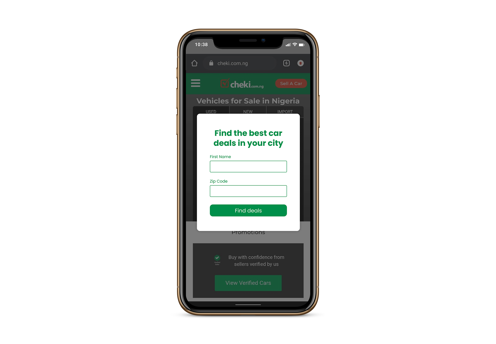
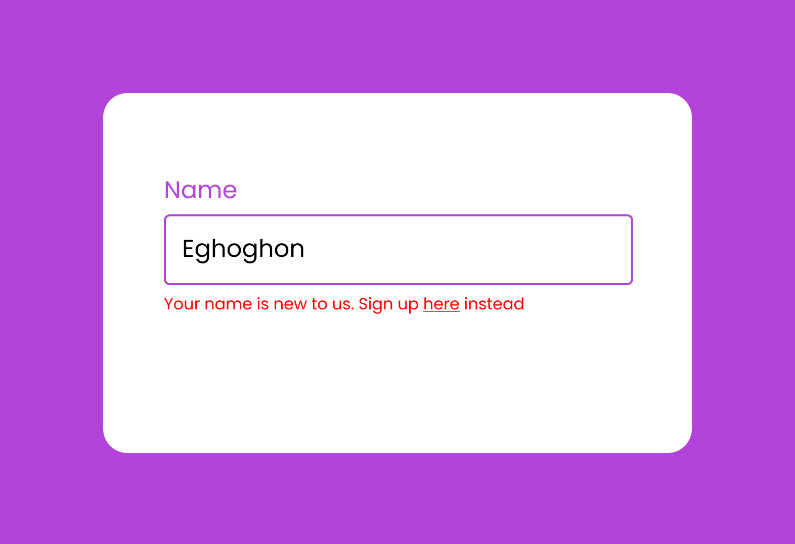
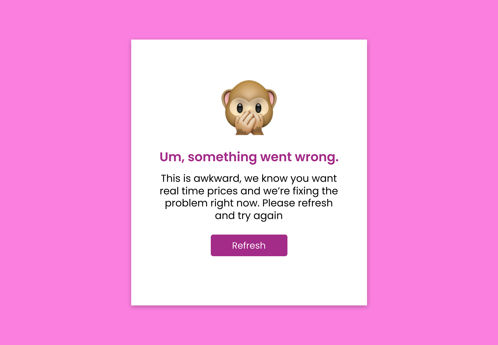

import Carousel from "../../../../components/Carousel"
import { convertTo3By3Array } from "../../../../util/functions"
import Img from "gatsby-image"
import { graphql } from "gatsby"

I signed up for the Daily UX Writing Challenge and got writing prompts in my mail for 15 days. It was a bit more challenging than I had assumed it would be especially because the restraints helped me to think and rethink about my word choices. I also designed all the screens because well, why not?
# Day 1
##### Scenario
## A traveler is in an airport waiting for the last leg of a flight home when their flight gets abruptly canceled due to bad weather.

##### Challenge
## Write a message from the airline app notifying them of the cancellation and what they need to do next.

## Headline: 45 characters   Body: 175 characters max   Button(s): 25 characters max  

Finding out you’re going to be stuck in an airport is not a fun experience so this wasn’t a time to be fun and light hearted. I worked on making the tone direct and empathetic while helping the user know what to expect next.

### 

# Day 2
##### Scenario
## A user is a working parent, and a big sports fan, in the midst of their favorite sports season who can no longer attend games.

##### Challenge
## Write a promotional screen for an app that lets a user choose teams, sends game reminders, real-time score updates and highlight videos.

## Headline: 40 characters max   Body: 175 characters max   Button(s): 25 characters max  

I enjoyed working on this because I got to use a little of my background in advertising copywriting. I kept the tone enthusiastic with buttons to help the user get the app immediately from whatever device they were using.

### 

# Day 3
##### Scenario
## The user entered the wrong email address to sign in to their account.

##### Challenge
## Tell the user to enter the right email.

## 40 characters max

Writing error messages can be tricky because you want to be clear without outrightly blaming the user even if it’s their fault. It’s why I was careful with the language I used and instead suggested for them to check and try again

### 

# Day 4
##### Scenario
## A user is in their favorite supermarket. They open the supermarket’s app on their phone to see what’s on sale and are greeted by a promotion.

##### Challenge
## Write a promotional home screen for a subscription service that delivers groceries to the user once-a-month for a flat fee.

## Headline: 45 characters max   Body: 175 characters max   Button(s): 25 characters max  

## I particularly enjoyed writing and designing these screens. I did a number of options because I couldn’t seem to decide on one. I worked on making them conversational although I was worried the play on words with “cart” in the first option might not be clear enough.
## I also included incentives in the buttons of the first 2 to make the users want to try it. The third option was a variant that was most likely relatable as they were inside a supermarket and maybe even on a queue, it also provided them with the pricing immediately.
If this was in a real life scenario, I would have suggested doing an A/B test to see which performed better.

### 

# Day 5
##### Scenario
## The user works in graphic design. While critiquing a design in a mobile app, their phone abruptly turns off. When they restart the phone, they reopen the app.

##### Challenge
## Write a message that the user will read immediately upon opening the app. What do they need to know? What steps (if any) do they need to take to recover their content? What if they can't recover the content?

## Headline: 40 characters max   Body: 140 characters max   Button(s): 20 characters max  

I have been in situations like this before, and the first thing I always want to know is if I had lost what I was working on. I worked to reassure the user about the safety of their files and provide next steps to recovering it.

### 

# Day 6
##### Scenario
## It’s Monday. A user has just gotten into their car to drive to work. They plug their phone into the car and start driving.

##### Challenge
## How would you let the user know there’s a fire happening in a nearby town that is causing road closures? The effect on their commute is unknown, but there is a definite danger if the fire gets closer. How do you communicate this to them? When? Write it.

## Headline: 30 characters max   Body: 45 characters max

In this scenario, the user is already driving and shouldn’t be distracted with too much text. I made sure the communication was as clear and succinct as possible while immediately providing alternatives.

### 

# Day 7
##### Scenario
## A sport fan is at a wedding while their favorite team is playing against their arch-rivals. Their team scores.

##### Challenge
## How would you, quickly, let the sports fan know about the latest play, the current score, and the key players? Write it.

## Headline: 30 characters max   Body: 45 characters max

Even though the user can’t watch the match at that moment, I wanted to give them the juicy details as quickly as possible so don’t miss out too much at the moment.

### 

# Day 8
##### Scenario
## The user is a casual music fan and (on occasion) goes to live concerts. They have a music player app on their phone.

##### Challenge
## Tell the user that one of their favorite bands is playing live in their town. How would you compel them to want to go?

## Headline: 30 characters max   Body: 45 characters max   Button: 25 character

I wanted to create excitement for the concert using the style of music the band plays - Highlife. They were also immediately presented with the option of buying a ticket.

### 

# Day 9
##### Scenario
## The user is trying to rent a car using an application but the credit card on file has expired.

##### Challenge
## Write them an error message so that they can correct the problem.

## Headline: 30 characters   Body: 45 characters

I was careful with this to ensure that it was clear and polite without shaming the user in any way.

### 

# Day 10
##### Scenario
## The user is trying to view a website to help them buy a car. But, the content can’t load without the user’s location. They need to enter their ZIP code and first name.

##### Challenge
## Ask them where they live and who they are without sounding like you're unnecessarily mining their data.

## Headline: 25 characters   Body: 45 characters   Body: 15 characters

I repurposed this using the headline to help the user see the data was needed in helping them find best car deals close to them.

### 

# Day 11
##### Scenario
## An elderly user is doing a Google search to find an easy way to buy contact lenses online.

##### Challenge
## Write a title and meta description for a website that sells subscription contact lenses delivered to a user every 30 days—convince them to try it.

## Title: 60 characters   Meta Description: 160 characters max

My goal here was to ensure the title and meta description were useful and conversational not just stuffed with a bunch of SEO Keywords. While keywords are important, it’s good to keep in mind that they will still be read by users.

### 

# Day 12
##### Scenario
## A user is creating an account. When they come to the step where they are asked to enter their name, they get an error message. A fraud detection software thinks their name is fake—but it’s wrong 5% of the time.

##### Challenge
## Write an error message that prompts them to fix the error without shaming them for having a fake-sounding name.

## 45 characters max

In this case, it’s not the user’s fault for having a unique name and the last thing I want to do is shame them. This challenge was difficult because I had just 45 characters to use. I opted for giving them an alternative way to sign up so they don’t feel stuck.

### 

# Day 13
##### Scenario
## A short-haul truck driver has a phone app that monitors his route, schedule, fuel & deliveries. He has 6 more deliveries before stopping for fuel and lunch. Due to unexpected traffic, he’s behind schedule. He can choose to stay on his planned route for a few more stops, but risk running low on fuel and missing lunch, or he can get fuel and lunch now and finish the deliveries later.

##### Challenge
## Write a push notification alerting him of this dilemma and options.

## Headline: 30 characters   Body: 45 characters max   Button(s): 25 characters max  

For this scenario, I wanted to be empathetic and not blame the driver for being behind on schedule because it’s not exactly his fault. I wrote the notification to clearly inform him about the situation and present him with his options to choose from.

### 

# Day 14
##### Scenario
## A user is shopping using a price comparison app that boasts “real-time” pricing on items. As they are checking the price of an item, something goes wrong. The problem is unknown.

##### Challenge
## Write a message that informs the user that they cannot access the app right now.  You cannot specify "why" the app doesn't work, you also want them to continue using the app.

## Headline: 30 characters   Body: 120 characters max   Button(s): 15 characters max  

For this case, I decided to use a little lighthearted humuor to take the blame for the error while reassuring the user that it was being worked on.

### 

# Day 15
##### Challenge
## Write a multi-screen onboarding experience for a banking app that automatically pays a user's bills every month—as long as they set it up correctly.

## Headline: 45 characters   Body: 100 characters   Button: 25 characters max  

This bonus challenge was definitely the most difficult to work on. It took a lot of thinking to decide what steps and information were necessary for the onboarding especially since the challenge had emphasized the need to set the app up correctly.

<Carousel>
  {
    convertTo3By3Array(props.data.day15Images.nodes).map(images => (
      

        {images.map(image => (
          
        ))}
      

    ))
  }
</Carousel>

# Conclusion

I enjoyed working on this challenge as it helped me think critically about writing for different scenarios and how it affects the users.

export const pageQuery = graphql`
 {
  day15Images: allFile(filter: {relativeDirectory: {eq:"articles/daily/fifteen"}}, sort: {fields: name, order: ASC}){
      nodes{
        name
        childImageSharp{
          fluid(quality: 80, maxWidth: 625){
              ...GatsbyImageSharpFluid_withWebp
          }
        }
      }
    }
 }
`
