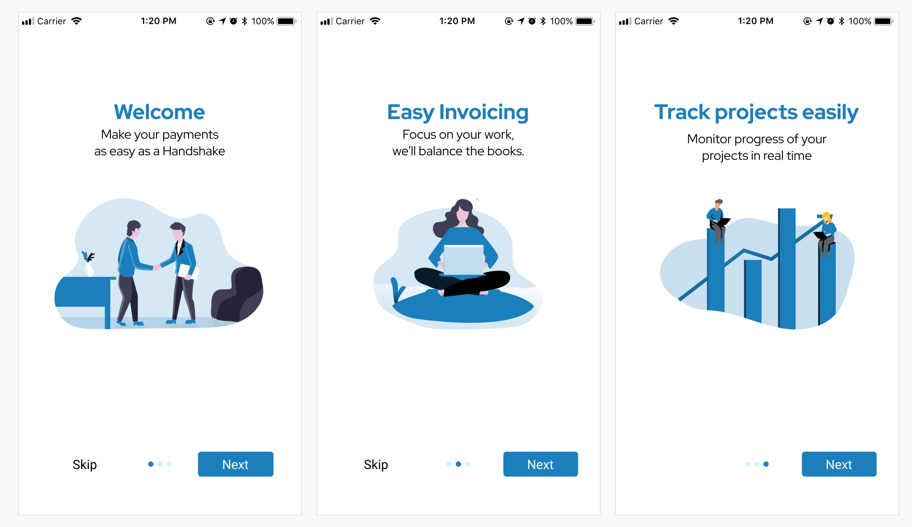

import { freelancerMapping, setupMapping } from "../../../../data/articles/handshake"
import Carousel from "../../../../components/Carousel"
import { graphql } from "gatsby"
import ArticleCarouselItem from "../../../../components/Article/articleCarouselItem"

This case study is from the final project of my UX Writing course on UXWC. We were to work on a fictional app called “Handshake”. The project provided already designed screens for us to review and correct the UI texts. After submitting the project and completing the course, I decided to redesign the UI.

### 

# Background

Handshake is a fictional app that makes interaction between freelancers and clients more seamless by ensuring that freelancers get paid and helping clients track the progress of work being done. The app is “shared” by these two user types. Each of them has a view of one side of the app: freelancer uses it to send invoices and track hours of work done while client uses it to pay and track progress of hours worked.

# Personas

We were given personas to help us understand the users we were writing for.

### 

Kelly is a web development graduate who recently started freelancing to save money and pay off student loans. She found out about Handshake from her elder sister who uses it for her catering business. She introduced it to Tom, her client, as an easy way to track progress and take care of billing. Tom runs a small heating and air conditioning business and needs an updated website. He thinks using Handshake is a good idea as he’d like a simple tool to track hours and progress of the work without constantly having to call Kelly.

# Challenge

## After reviewing the UI texts in the screens we were given, I noticed problems that would make the app difficult for users like Kelly and Tom. Some of these problems include:

- Unclear copy that confused users on how to navigate and what to do next.
- Inconsistent style for capitalization, money formatting, terms etc.
- Lack of effective voice and tone.
- Grammar, spelling and punctuation errors.

# What I Did

## This is a summary of the things I did to give “Handshake” a better and more seamless experience.

- Developed new copy and edited existing copy with a warm, friendly and human tone of voice.
- Included hint text and microcopy where necessary for clarity to help the user have a better experience.
- Redesigned the UI and some parts of the user flow.
- Maintained a consistent style for capitalization, money formatting and terms used.

# User Flow Chart
I started by sketching a user flow chart to help me understand and map out the key structure, content and different touchpoints in the user journey.

#### 

# Onboarding
I realized that there were no onboarding screens in the initial designs so I created these to give a simple overview and introduction to what the app does using a friendly, warm and professional tone of voice.

### 

# Sign Up
In the previous user flow, a first time user just went straight to filling in details about their project without creating an account first so I redesigned the process to include an account creation form so they can sign in easily when next they are using the app.

<Carousel>
  {
    props.data.signUpImages.nodes.map(node => (
      <ArticleCarouselItem
        name={node.name}
        fluid={node.childImageSharp.fluid}
      />
    ))
  }
</Carousel>

# Set Up
## This is the stage where the user fills in details of their project. I edited the copy for consistency of terms and clarity while still ensuring it maintained the right tone of voice. I also included some hint text and microcopy to help the users understand the right information to fill.

## The previous design had used the term “1099 Workers” was changed to “Freelancers” as my research had shown that it was the more commonly used term by users.

In the previous design, after inviting the freelancer/client, the success modal didn’t clearly state what had happened and what to expect so I edited the copy to help the users understand and know what to do next.

<Carousel>
  {
    props.data.setupImages.nodes.map(node => (
      <ArticleCarouselItem
        name={setupMapping[node.name]}
        fluid={node.childImageSharp.fluid}
      />
    ))
  }
</Carousel>

# Ongoing Use
The goal here was to ensure that the copy and general experience was as seamless and easy to use as possible for the user. The previous copy had typos, lacked clarity and was inconsistent in its style of capitalization and money formatting.

# Client Ongoing Use
The previous decision dialog was confusing as it allowed the client to already take the decision and send payment before asking if they wanted to cancel it. I rewrote the dialog headline as a question and the body text was rewritten so the client could see the decision they were about to take. The button text was also rewritten to properly seek confirmation and prevent the client from making an unintentional mistake.

<Carousel>
  {
    props.data.ongoingImages.nodes.map(node => (
      <ArticleCarouselItem
        name={node.name}
        fluid={node.childImageSharp.fluid}
      />
    ))
  }
</Carousel>

# Freelancer Ongoing Use

## For the freelancer ongoing use, the previous design hid the project description in a tool tip and this was important information so it was added to the main screen in the redesigned version.

The confirmation dialogue text also needed to be rewritten. The headline and body text was edited to be more concise. The previous button text was “Cancel” and “Yes”, this was a problem as it was unclear what would happen if the freelancer clicks either of the buttons. This was rewritten so the freelancer could be sure of what action they were taking when they clicked any of the buttons.

<Carousel>
  {
    props.data.freelancerImages.nodes.map(node => (
      <ArticleCarouselItem
        name={freelancerMapping[node.name]}
        fluid={node.childImageSharp.fluid}
      />
    ))
  }
</Carousel>

# Messaging
The previous messaging screens were complex and confusing. I redesigned it to make it simpler and more straightforward to use.

<ArticleCarouselItem
  name='Messaging Screens'
  fluid={props.data.messagesImage?.childImageSharp.fluid}
  maxWidth='80%'
/>

# Next Steps: User Testing
## It’s important to test the new designs and updated copy with users so as to measure its usability and ensure that it delivers an all round great user experience.

export const pageQuery = graphql`
 {
  signUpImages: allFile(filter: {relativeDirectory: {eq:"articles/handshake/sign-up"}}, sort: {fields: name, order: ASC}){
      nodes{
        name
        childImageSharp{
          fluid(quality: 80, maxWidth: 1800){
              ...GatsbyImageSharpFluid_withWebp
          }
        }
      }
    }
  ongoingImages: allFile(filter: {relativeDirectory: {eq:"articles/handshake/ongoing"}}, sort: {fields: name, order: ASC}){
      nodes{
        name
        childImageSharp{
        fluid(quality: 80, maxWidth: 1800){
            ...GatsbyImageSharpFluid_withWebp
          }
        }
      }
    }
  freelancerImages: allFile(filter: {relativeDirectory: {eq:"articles/handshake/freelancer"}}, sort: {fields: name, order: ASC}){
    nodes{
      name
      childImageSharp{
      fluid(quality: 80, maxWidth: 1800){
          ...GatsbyImageSharpFluid_withWebp
        }
      }
    }
  }
  setupImages: allFile(filter: {relativeDirectory: {eq:"articles/handshake/setup"}}, sort: {fields: name, order: ASC}){
    nodes{
      name
      childImageSharp{
      fluid(quality: 80, maxWidth: 1800){
          ...GatsbyImageSharpFluid_withWebp
        }
      }
    }
  }
  messagesImage: file(relativePath: {eq:"articles/handshake/5.jpg"}){
      childImageSharp{
          fluid(quality: 80, maxWidth: 1800){
            ...GatsbyImageSharpFluid_withWebp
          }
        }
      }
 }
`

